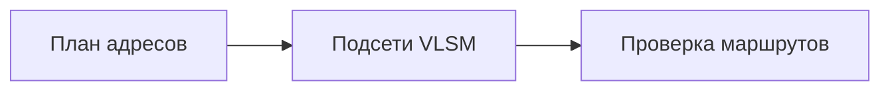

# Маски подсетей и VLSM

## Схема

```mermaid
flowchart LR
    n0["План адресов"]
    n1["Подсети VLSM"]
    n2["Проверка маршрутов"]
    n0 --> n1 --> n2
```

## Что сделал

- Рассчитал маски, диапазоны хостов и broadcast для учебных подсетей.
- Настроил адресацию и проверил связь внутри сегментов и между ними.
