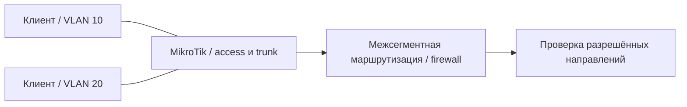

# VLAN и сегментация

## Схема

```mermaid
flowchart LR
    a["Клиент / VLAN 10"] --- sw["MikroTik / access и trunk"]
    b["Клиент / VLAN 20"] --- sw
    sw --> fw["Межсегментная маршрутизация / firewall"]
    fw --> result["Проверка разрешённых направлений"]
```

## Что сделал

- Настроил VLAN, access- и trunk-порты на MikroTik.
- Проверил связь внутри VLAN и ограничения между сегментами.
