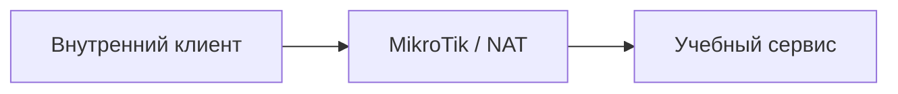

# NAT и публикация сервисов

## Схема

```mermaid
flowchart LR
    n0["Внутренний клиент"]
    n1["MikroTik / NAT"]
    n2["Учебный сервис"]
    n0 --> n1 --> n2
```

## Что сделал

- Настроил исходящую трансляцию адресов и перенаправление на учебный сервис.
- Проверил счётчики правил NAT и изменение адресов в соединениях.
