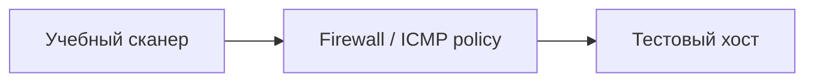

# ICMP и обнаружение узлов

## Схема

```mermaid
flowchart LR
    n0["Учебный сканер"]
    n1["Firewall / ICMP policy"]
    n2["Тестовый хост"]
    n0 --> n1 --> n2
```

## Что сделал

- Проверил обнаружение учебных узлов с помощью ICMP и Nmap.
- Разобрал ICMP-пакеты и влияние фильтрации на результаты проверки.
