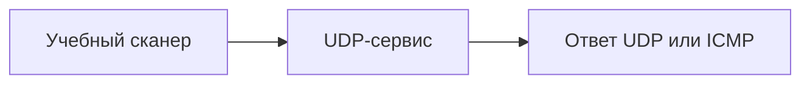

# UDP-сканирование

## Схема

```mermaid
flowchart LR
    n0["Учебный сканер"]
    n1["UDP-сервис"]
    n2["Ответ UDP или ICMP"]
    n0 --> n1 --> n2
```

## Что сделал

- Выполнил UDP-сканирование заданных портов учебного хоста.
- Сопоставил ответы сервисов и ICMP-ошибки с результатами Nmap.
