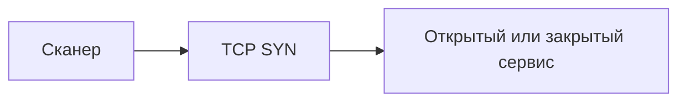

# TCP-сканирование и состояния портов

## Схема

```mermaid
flowchart LR
    n0["Сканер"]
    n1["TCP SYN"]
    n2["Открытый или закрытый сервис"]
    n0 --> n1 --> n2
```

## Что сделал

- Сравнил TCP connect и SYN scan на учебном хосте.
- Разобрал SYN, SYN-ACK и RST и сопоставил их с состояниями портов.
