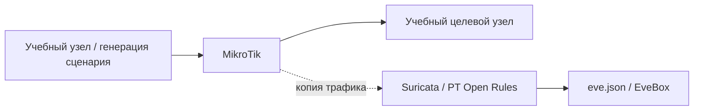

# Sliver: обнаружение HTTP-обмена

## Схема

```mermaid
flowchart LR
    client["Учебный узел / генерация сценария"] --> router["MikroTik"]
    router --> target["Учебный целевой узел"]
    router -. "копия трафика" .-> ids["Suricata / PT Open Rules"]
    ids --> eve["eve.json / EveBox"]
```

## Что сделал

- Воспроизвёл учебный HTTP-обмен Sliver.
- Сопоставил запрос с alert Suricata и разобрал URI, заголовки и формат тела запроса.
