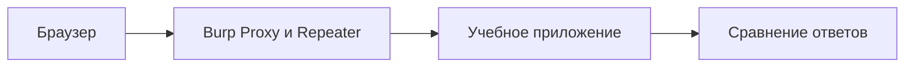

# Burp Suite: перехват HTTP/HTTPS

## Схема

```mermaid
flowchart LR
    n0["Браузер"]
    n1["Burp Proxy и Repeater"]
    n2["Учебное приложение"]
    n3["Сравнение ответов"]
    n0 --> n1 --> n2 --> n3
```

## Что сделал

- Настроил перехват запросов учебного приложения в Burp Suite.
- Отправил запрос в Repeater, изменил параметр и сравнил ответы сервера.
