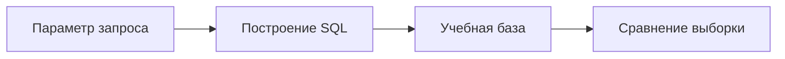

# SQL Injection

## Схема

```mermaid
flowchart LR
    n0["Параметр запроса"]
    n1["Построение SQL"]
    n2["Учебная база"]
    n3["Сравнение выборки"]
    n0 --> n1 --> n2 --> n3
```

## Что сделал

- Воспроизвёл SQL Injection на тестовых данных учебного приложения.
- Проверил влияние пользовательского ввода на логику SQL-запроса.
