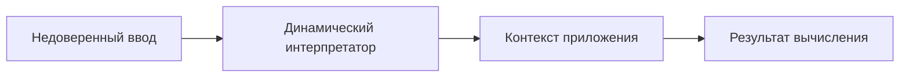

# Code Injection

## Схема

```mermaid
flowchart LR
    n0["Недоверенный ввод"]
    n1["Динамический интерпретатор"]
    n2["Контекст приложения"]
    n3["Результат вычисления"]
    n0 --> n1 --> n2 --> n3
```

## Что сделал

- Исследовал обработку выражений и воспроизвёл Code Injection на учебном стенде.
- Разобрал выполнение пользовательского ввода как кода приложения.
