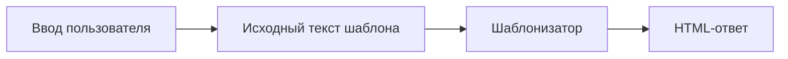

# SSTI и граница шаблона

## Схема

```mermaid
flowchart LR
    n0["Ввод пользователя"]
    n1["Исходный текст шаблона"]
    n2["Шаблонизатор"]
    n3["HTML-ответ"]
    n0 --> n1 --> n2 --> n3
```

## Что сделал

- Воспроизвёл SSTI и определил контекст обработки пользовательского ввода шаблонизатором.
- Проверил вычисление выражения на стороне сервера.
